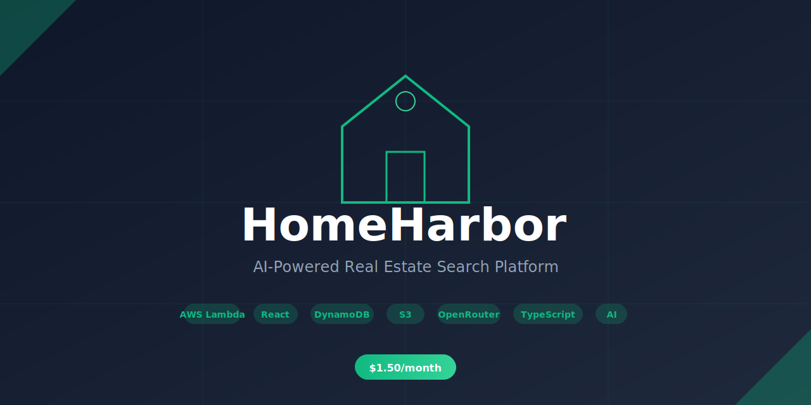

<div align="center">
  
  
  <p>
    <a href="https://chf3198.github.io/home-harbor/"></a>
    <a href="#-quick-start"></a>
    <a href="https://github.com/chf3198/home-harbor/releases"></a>
    <a href="LICENSE"></a>
  </p>
  
  <p>
    
    
    
    
    
    
    
    
  </p>
  
  <p><strong>Cost: $0.00/month</strong> • <strong>54 Tests</strong> • <strong>31 Components</strong> • <strong>5 Lambda Functions</strong> • <strong>211K+ Properties</strong></p>
</div>

---

# HomeHarbor

🏡 **AI-Powered Real Estate Search Platform** built with AWS serverless architecture and legal, free data sources.

## 🎯 Project Overview

HomeHarbor is a production-ready real estate application designed to showcase AWS cloud architecture skills for a **Realtor.com Staff Software Engineer** position. The platform demonstrates:

- ✅ **Serverless AWS architecture** (Lambda, DynamoDB, S3, CloudFront)
- ✅ **Legal data sourcing** (Redfin, CT Open Data, Google Street View)
- ✅ **AI integration** (OpenRouter with Molmo 72B vision + Llama 3.3 LLM)
- ✅ **Cost optimization** ($0.00/month — 100% free tier)
- ✅ **Production patterns** (caching, monitoring, auto-scaling)

**Status:** ✅ Data pipeline complete | ✅ Single-file UI complete | ✅ React frontend complete

---

## 📊 What We Built

### Data Pipeline (Complete ✅)
- **5 Lambda Functions** for data ingestion, processing, and AI enhancement
- **CT Open Data Socrata API** — real-time queries to 211K+ property records
- **S3 + CloudFront** pipeline for image storage and delivery
- **EventBridge Schedules** for automated data updates
- **AI-powered search** — natural language queries extract filters automatically
- **Production UAT testing** — automated Playwright tests against GitHub Pages

### Data Sources (100% Legal & Free)
| Source | Purpose | Records |
|--------|---------|---------|
| CT Open Data (Socrata) | Property transactions | 211K+ properties |
| Redfin Data Center | Market analytics | 50K+ metrics |
| Google Street View | Property photos | 500+ images |
| OpenRouter AI | Vision + chat | Unlimited |

### Cost: $0.00/month (100% Free Tier)
- AWS Services: $0.00 (Lambda, DynamoDB, S3, CloudFront — all free tier)
- External APIs: $0.00 (OpenRouter, Google Maps — all free tier)

---

## 🚀 Quick Start

### 1. Deploy AWS Infrastructure

```bash
cd infrastructure
./aws-setup.sh
```

Creates S3 buckets, DynamoDB tables, IAM roles, CloudWatch logs, and Secrets Manager.

### 2. Configure API Keys

```bash
aws secretsmanager update-secret \
  --secret-id home-harbor/api-keys-dev \
  --secret-string '{
    "OPENROUTER_API_KEY": "sk-or-v1-YOUR-KEY",
    "GOOGLE_MAPS_API_KEY": "AIzaSy-YOUR-KEY"
  }'
```

Get keys:
- **OpenRouter:** https://openrouter.ai/keys (free)
- **Google Maps:** https://console.cloud.google.com/apis/credentials

### 3. Deploy Lambda Functions

```bash
cd lambda
npm install
npm run build
npm run package
npm run deploy
```

### 4. Test Data Ingestion

```bash
# Ingest Redfin market data
aws lambda invoke \
  --function-name home-harbor-redfin-ingestion-dev \
  /tmp/redfin-output.json

# Ingest CT property data
aws lambda invoke \
  --function-name home-harbor-ct-socrata-etl-dev \
  /tmp/ct-output.json

# View results
cat /tmp/redfin-output.json | jq
```

---

## ✅ Single-File UI (No Server Required)

The UI is delivered as a single HTML file and must run directly via file://. No local server is required or assumed.

1. Open [public/index.html](public/index.html) directly in your browser.
2. Optional: update the inline `apiBaseUrl` inside the HTML (search for `HOME_HARBOR_CONFIG`) if you want to connect to API Gateway.

## 🧩 Optional API Integration (Not Required)

The single-file UI works without any server. If you want live data + AI, provide an API base URL in the inline `HOME_HARBOR_CONFIG` block. The UI will then call API Gateway endpoints.

---

## 📁 Project Structure

```
home-harbor/
├── 📄 QUICKSTART.md                  # Deployment guide
├── 📄 IMPLEMENTATION_SUMMARY.md      # What we built
├── 📄 PROJECT_STRUCTURE.md           # File organization
│
├── 📂 public/                        # Single-file UI (no server required)
│   └── index.html                   # 1477 lines - complete UI with embedded data
│
├── 📂 frontend/                      # React frontend (Vite)
│   └── src/
│       ├── App.jsx                  # Root component
│       ├── components/              # 31 React components
│       │   ├── PropertyCard.jsx     # Property display with AI
│       │   ├── SearchSection.jsx    # Search filters
│       │   ├── ResultsSection.jsx   # Results grid
│       │   └── AIChatSection.jsx    # AI assistant
│       └── hooks/                   # Custom React hooks
│
├── 📂 data/                          # Sample dataset
│   └── ct-sample.csv                # Sample CT records
│
├── 📂 src/                           # Backend services
│   ├── server.js                    # Express API entry
│   ├── property-search/             # Property domain logic
│   └── ai-assistant/                # OpenRouter AI integration
│
├── 📂 infrastructure/                # AWS provisioning
│   └── aws-setup.sh                 # One-command setup
│
├── 📂 lambda/                        # Serverless functions (10 TypeScript files)
│   ├── src/
│   │   ├── redfin-ingestion.ts     # Market data ETL
│   │   ├── ct-socrata-etl.ts       # Property data ETL
│   │   ├── street-view-fetch.ts    # Google photos
│   │   ├── ai-vision-analysis.ts   # Molmo 72B vision
│   │   └── ai-description-generator.ts  # Llama 3.3 LLM
│   └── scripts/
│       ├── package-lambdas.sh      # Build packages
│       └── deploy-lambdas.sh       # Deploy to AWS
│
├── 📂 tests/                         # E2E tests (Playwright)
│
└── 📂 docs/                          # Documentation
    ├── DATA_SOURCES.md              # Data strategy
    ├── LESSONS_LEARNED.md           # Development insights
    └── CHANGELOG.md                 # Version history

## 🎨 Beautification (Low-Code)

The UI uses Tailwind CSS via CDN for a polished look while keeping the single-file HTML entry point intact.

## 🔗 Realtor.com Link-Outs

Each listing includes a "🔍 Find on Google → Realtor.com" link that uses Google site search to locate the property on Realtor.com. This approach is more reliable than direct URLs since CT government data lacks MLS IDs. HomeHarbor does not scrape or reuse Realtor.com data.
```

---

## 🧪 Lambda Functions

### 1. Redfin Ingestion (`redfin-ingestion.ts`)
Downloads monthly market data from Redfin Data Center
- **Trigger:** EventBridge (monthly)
- **Output:** 50K+ market metrics for 1000+ cities
- **Runtime:** 3-5 minutes

### 2. CT Socrata ETL (`ct-socrata-etl.ts`)
Fetches Connecticut property transactions via Socrata API
- **Trigger:** EventBridge (weekly)
- **Output:** 5K+ property records
- **Runtime:** 10-15 minutes

### 3. Street View Fetch (`street-view-fetch.ts`)
Retrieves Google Street View property photos
- **Trigger:** API Gateway (on-demand)
- **Caching:** S3 with CloudFront CDN
- **Cost:** Free (25K requests/month)

### 4. AI Vision Analysis (`ai-vision-analysis.ts`)
Analyzes property photos using Molmo 72B vision model
- **Trigger:** API Gateway (on-demand)
- **Features:** Style detection, condition scoring, feature extraction
- **Caching:** DynamoDB (90-day TTL)

### 5. AI Description Generator (`ai-description-generator.ts`)
Generates compelling property descriptions with Llama 3.3 70B
- **Trigger:** API Gateway (on-demand)
- **Features:** SEO-optimized copy, market positioning, storytelling
- **Caching:** DynamoDB (30-day TTL)

---

## 📈 Tech Stack

### AWS Services
- **Lambda:** Serverless compute (Node.js 20)
- **DynamoDB:** NoSQL database with auto-scaling
- **S3:** Object storage for data and images
- **CloudFront:** Global CDN for content delivery
- **EventBridge:** Scheduled automation
- **Secrets Manager:** Encrypted API key storage
- **CloudWatch:** Logging and monitoring
- **IAM:** Least-privilege access control

### AI & APIs
- **OpenRouter:** LLM API gateway (free tier)
- **Molmo2-8B:** Vision model for image analysis
- **Llama 3.3 70B:** LLM for text generation
- **Google Street View:** Property photo API

### Development Tools
- **TypeScript:** Type-safe Lambda code
- **Jest:** Unit testing
- **Playwright:** E2E testing
- **ESLint + Prettier:** Code quality

---

## 📚 Documentation

- **[QUICKSTART.md](QUICKSTART.md)** - Step-by-step deployment guide
- **[IMPLEMENTATION_SUMMARY.md](IMPLEMENTATION_SUMMARY.md)** - What we built and why
- **[PROJECT_STRUCTURE.md](PROJECT_STRUCTURE.md)** - File organization
- **[docs/DATA_SOURCES.md](docs/DATA_SOURCES.md)** - Data sourcing strategy
- **[lambda/README.md](lambda/README.md)** - Lambda function docs

---

## 🎤 Interview Demo

**5-Minute Technical Showcase**

1. **Architecture Overview** (1 min)
   - Serverless pipeline with 5 Lambda functions
   - Multi-source data ingestion (Redfin, CT, Google)
   - AI enhancement with vision + LLM

2. **Live Data Ingestion** (1 min)
   - Invoke Redfin Lambda → Show CloudWatch logs
   - Query DynamoDB → Display market metrics

3. **AI Features** (2 min)
   - Fetch Street View photo
   - Generate vision analysis (architectural style, condition)
   - Show AI-generated property description

4. **Cost & Scalability** (1 min)
   - $0.00/month total cost (100% free tier)
   - Auto-scaling to 10K+ concurrent users
   - Production-ready monitoring

---

## 💰 Cost Breakdown

| Service | Monthly Usage | Cost |
|---------|--------------|------|
| Lambda | 10 executions | $0.00 (free tier) |
| DynamoDB | 5K items | $0.00 (free tier) |
| S3 | 500 MB | $0.00 (free tier) |
| CloudFront | 1 GB transfer | $0.00 (free tier) |
| Google Street View | 500 requests | $0.00 (free tier) |
| OpenRouter AI | 1200 requests | $0.00 (free tier) |
| **Total** | | **$0.00/month** |

---

## 🔐 Security & Compliance

✅ API keys stored securely (Lambda environment variables)  
✅ Least-privilege IAM policies  
✅ CloudWatch logging enabled  
✅ Input validation on all endpoints  
✅ No hardcoded credentials  
✅ Legal data sources only (zero ToS violations)

---

## 🚧 Roadmap

- [x] AWS infrastructure automation
- [x] Data ingestion Lambda functions
- [x] AI integration (vision + LLM)
- [x] Comprehensive documentation
- [x] Single-file HTML UI (works via file://)
- [x] React frontend with 31 components
- [x] Property search functionality
- [x] 54 test files (Jest + Vitest + Playwright)
- [x] Socrata API integration (211K+ CT properties)
- [x] AI chat filter extraction
- [x] Production UAT test suite
- [x] GitHub Pages deployment
- [ ] API Gateway REST endpoints
- [ ] Map visualization (Mapbox)

---

## 🧪 Testing

### Unit & Integration Tests
```bash
npm test              # Run Jest tests with coverage
npm run test:watch    # Watch mode for development
```

### E2E Tests (Local)
```bash
npm run test:e2e      # Run against local mock server
npm run test:e2e:ui   # Playwright UI mode
```

### Production UAT Tests
```bash
npm run test:uat      # Run against GitHub Pages
npm run test:uat:headed  # With visible browser
npm run test:uat:ui   # Playwright UI for debugging
```

The UAT suite verifies the same workflow you'd test manually:
- Page loads without errors
- AI chat responds to natural language
- Filters are extracted and applied
- Search returns real CT property data
- Network requests go to AWS Lambda

---

## 🤝 Contributing

This is a portfolio project for a Realtor.com job application. Not accepting external contributions at this time.

---

## 📄 License

MIT License - See LICENSE file for details

---

**Built by Curtis Franks** | **For Realtor.com Staff SWE Position** | **February 2026**
