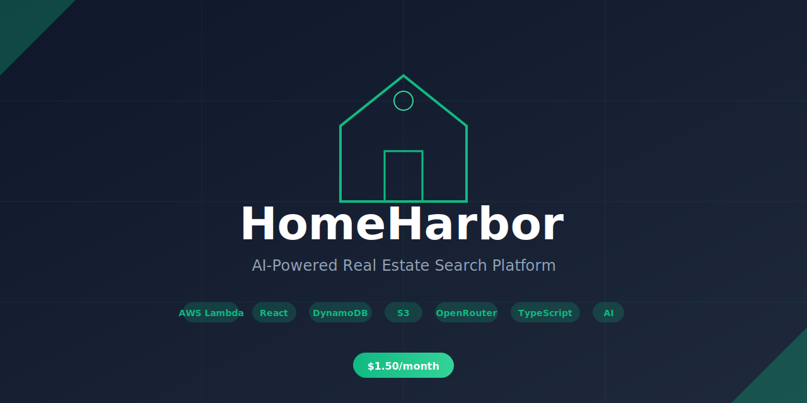

# HomeHarbor

<div align="center">
  

  <p>
    <a href="https://chf3198.github.io/home-harbor/"></a>
    <a href="#quick-start"></a>
    <a href="https://github.com/chf3198/home-harbor/releases"></a>
    <a href="LICENSE"></a>
  </p>

  <p>
    
    
    
    
    
    
  </p>

  <p><strong>Cost: $0.00/month</strong> · <strong>54 Tests</strong> · <strong>31 Components</strong> · <strong>6 Lambda Functions</strong> · <strong>211K+ Properties</strong></p>
</div>

---

# HomeHarbor

**HomeHarbor** is an AI-powered real estate search application built on a serverless AWS architecture that costs $0/month. Users search with natural language — "3 bedroom homes under $400k near Hartford" — and the AI extracts structured filters and queries 211K+ Connecticut property records from the CT Open Data Socrata API in real time. Built with AWS Lambda (6 functions), DynamoDB, S3, CloudFront, React 18 + Vite, TypeScript, Tailwind CSS, OpenRouter (routing to Llama 3.3 70B and Molmo 72B vision), and tested with 54 tests across Jest, Vitest, and Playwright.

---

## Project Overview

| Category | What Was Built |
|----------|---------------|
| **Cloud Architecture** | 6 Lambda functions, DynamoDB, S3, CloudFront, EventBridge, Secrets Manager |
| **AI/NLP Integration** | Natural language → structured query filters via LLM (OpenRouter) |
| **Cost Engineering** | $0.00/month — 100% AWS free tier |
| **Resilience** | Cascading model fallbacks, graceful degradation |
| **Frontend** | React 18 SPA (31 components) + single-file HTML option |
| **Testing** | 54 tests: Jest, Vitest, Playwright E2E, production UAT |
| **Data** | 211K+ CT property records via Socrata API |

**Status:** ✅ Fully deployed and functional

---

## Architecture

```
Frontend (React SPA on GitHub Pages)
         │ HTTPS
         ▼
   API Gateway
         │
         ▼
Lambda Functions (Node.js 20)
 ├── properties-socrata.ts  → CT Open Data Socrata API (211K+ records)
 ├── chat.ts                → OpenRouter: Llama 3.3 70B (filter extraction)
 ├── analyze.ts             → OpenRouter: Molmo 72B (vision analysis)
 ├── describe.ts            → OpenRouter: Llama 3.3 70B (property descriptions)
 ├── redfin-ingestion.ts    [code complete, not deployed]
 └── street-view-fetch.ts   [code complete, not deployed]
         │
         ▼
Infrastructure
 ├── DynamoDB  (cache)
 ├── S3        (images)
 └── Secrets Manager (API keys)
```

### AI Filter Extraction

The core technical challenge: converting natural language to structured database filters.

```
User: "Show me 3 bedroom homes under $400k near Hartford"
         │
         ▼
Lambda chat.ts — prompt engineering:
  - CT town knowledge embedded
  - Handles ambiguous queries
  - Extracts multiple filter types
         │
         ▼
OpenRouter API (cascading model fallbacks):
  1. Try:  meta-llama/llama-3.3-70b
  2. Fall: google/gemini-flash
  3. Fall: anthropic/claude-haiku
         │
         ▼
Extracted: { beds: 3, maxPrice: 400000, city: "Hartford" }
```

### Key Architectural Decisions

| Decision | Rationale |
|----------|-----------|
| **Serverless Lambda** | Zero idle cost, auto-scaling, no server management |
| **OpenRouter for LLM** | Single API for multiple models with built-in fallbacks |
| **Socrata API (not scraping)** | Legal, reliable, structured government data |
| **React + single-file HTML** | SPA for rich UX; file:// option for demos without a server |
| **GitHub Pages hosting** | Free, reliable, CI/CD via Actions |

---

## What Was Built

### Deployed and Working ✅

- 6 Lambda functions — Properties, Cities, Metadata, Chat, Analyze, Describe
- CT Open Data Socrata API — real-time queries to 211K+ property records
- AI-powered natural language search — queries automatically extract structured filters
- React SPA — deployed to GitHub Pages with CI/CD
- Production UAT tests — automated Playwright suite running against GitHub Pages

### Code Written, Not Yet Deployed 📝

| Feature | Lambda File | Notes |
|---------|-------------|-------|
| Redfin Market Data | `redfin-ingestion.ts` | Code complete, not in SAM template |
| Street View Photos | `street-view-fetch.ts` | Code complete, not in SAM template |

---

## Quick Start

### 1. Deploy AWS Infrastructure

```bash
cd infrastructure
./aws-setup.sh
```

### 2. Configure API Keys

```bash
aws secretsmanager update-secret \
  --secret-id home-harbor/api-keys-dev \
  --secret-string '{
    "OPENROUTER_API_KEY": "sk-or-v1-YOUR-KEY",
    "GOOGLE_MAPS_API_KEY": "AIzaSy-YOUR-KEY"
  }'
```

- **OpenRouter:** [openrouter.ai/keys](https://openrouter.ai/keys) (free tier available)
- **Google Maps:** [console.cloud.google.com](https://console.cloud.google.com/apis/credentials)

### 3. Deploy Lambda Functions

```bash
cd lambda && npm install && npm run build && npm run deploy
```

### 4. Run the UI

Open [public/index.html](public/index.html) directly in your browser. No local server required. To connect to live data, update the `HOME_HARBOR_CONFIG` block inside the HTML with your API Gateway base URL.

---

## Lambda Functions

| Function | File | Description |
|----------|------|-------------|
| **Properties** | `properties-socrata.ts` | Real-time search via CT Open Data. GET /properties, /cities, /metadata. 211K+ records. |
| **Chat** | `chat.ts` | Natural language → structured filters. POST /chat. Llama 3.3 70B with fallbacks. |
| **Analyze** | `analyze.ts` | AI vision analysis of property photos. POST /analyze. Molmo 72B. |
| **Describe** | `describe.ts` | AI property descriptions. POST /describe. Llama 3.3 70B. |
| **Redfin Ingestion** | `redfin-ingestion.ts` | Monthly market data from Redfin Data Center. *(Code complete, not deployed)* |
| **Street View** | `street-view-fetch.ts` | Google Street View exterior photos. *(Code complete, not deployed)* |

---

## Tech Stack

### AWS Services

| Service | Purpose |
|---------|---------|
| Lambda | Serverless compute (Node.js 20) |
| DynamoDB | NoSQL cache with on-demand scaling |
| S3 | Object storage for data and images |
| CloudFront | Global CDN |
| EventBridge | Scheduled automation |
| Secrets Manager | Encrypted API key storage |

### AI & Frontend

| Technology | Purpose |
|-----------|---------|
| OpenRouter | LLM API gateway (free tier) |
| Llama 3.3 70B | Text generation and filter extraction |
| Molmo 72B | Vision model for image analysis |
| CT Open Data (Socrata) | 211K+ Connecticut property records |
| React 18 + Vite | Frontend SPA (31 components) |
| TypeScript 5 | Type-safe Lambda code |
| Tailwind CSS 3 | Styling |
| Playwright | E2E and production UAT tests |

---

## Cost Breakdown

| Service | Monthly Usage | Cost |
|---------|--------------|------|
| Lambda | 10 executions | $0.00 (free tier) |
| DynamoDB | 5K items | $0.00 (free tier) |
| S3 | 500 MB | $0.00 (free tier) |
| CloudFront | 1 GB transfer | $0.00 (free tier) |
| OpenRouter AI | 1200 requests | $0.00 (free tier) |
| **Total** | | **$0.00/month** |

---

## Testing

```bash
npm test                 # Jest unit tests with coverage
npm run test:e2e         # Playwright E2E against local mock server
npm run test:uat         # Playwright UAT against GitHub Pages (production)
npm run test:uat:headed  # UAT with visible browser
```

---

## Project Structure

```
home-harbor/
├── public/                   # Single-file UI (works via file://)
│   └── index.html            # 1477 lines — complete UI with embedded data
├── frontend/                 # React frontend (Vite)
│   └── src/
│       ├── App.jsx
│       ├── components/       # 31 React components
│       └── hooks/
├── lambda/                   # Serverless functions (TypeScript)
│   └── src/
│       ├── properties-socrata.ts
│       ├── chat.ts
│       ├── analyze.ts
│       └── describe.ts
├── infrastructure/
│   └── aws-setup.sh
├── tests/
└── docs/
    ├── DATA_SOURCES.md
    ├── LESSONS_LEARNED.md
    └── CHANGELOG.md
```

---

## Documentation

| Document | Description |
|----------|-------------|
| [QUICKSTART.md](QUICKSTART.md) | Step-by-step deployment guide |
| [IMPLEMENTATION_SUMMARY.md](IMPLEMENTATION_SUMMARY.md) | What was built and why |
| [docs/DATA_SOURCES.md](docs/DATA_SOURCES.md) | Data sourcing strategy |
| [docs/LESSONS_LEARNED.md](docs/LESSONS_LEARNED.md) | Development insights and hard-won lessons |

---

## About

**Curtis Franks** — Full-stack software engineer specializing in serverless AWS architecture and AI integration.

- Portfolio: [curtisfranks.com](https://curtisfranks.com)
- LinkedIn: [linkedin.com/in/curtisfranks](https://linkedin.com/in/curtisfranks)

---

## License

**[PolyForm Noncommercial 1.0.0](LICENSE)** — free for personal, educational, and non-commercial use. Commercial use requires a paid license. See [COMMERCIAL-LICENSE.md](COMMERCIAL-LICENSE.md) or contact [curtisfranks@gmail.com](mailto:curtisfranks@gmail.com).

© 2026 Curtis Franks

---

*Built with ☕ and curiosity · February 2026*
